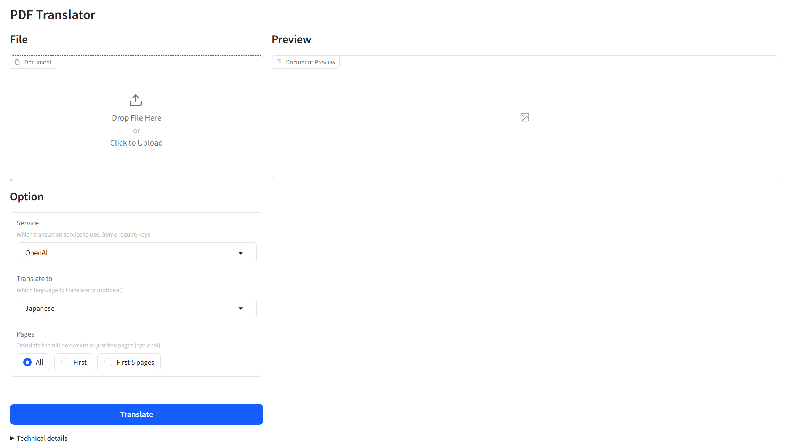

# LLM PPT Translator

## UI Preview




## Installation

```
conda create -n llm-pdf-translator python=3.11 -y
conda activate llm-pdf-translator
```

```
pip install -e .
pip install -r requirements.txt
# pip list --format=freeze > requirements.txt
```

## Configration

```
cp .env.example .env
```

Modify the following parameters:

- For OpenAI API
```
OPENAI_API_KEY=sk-******
OPENAI_BASE_URL=http://xxx.xxx.xxx.xxx:8000/v1
OPENAI_MODEL_NAME=gpt-4
```

## Run

```
pdf2zh -i
```

## Access

Open [http://127.0.0.1:7860](http://127.0.0.1:7860)

## Limitation

- This project is forked from [https://github.com/Byaidu/PDFMathTranslate](https://github.com/Byaidu/PDFMathTranslate), please follow its license.

## Welcome to WeChat


